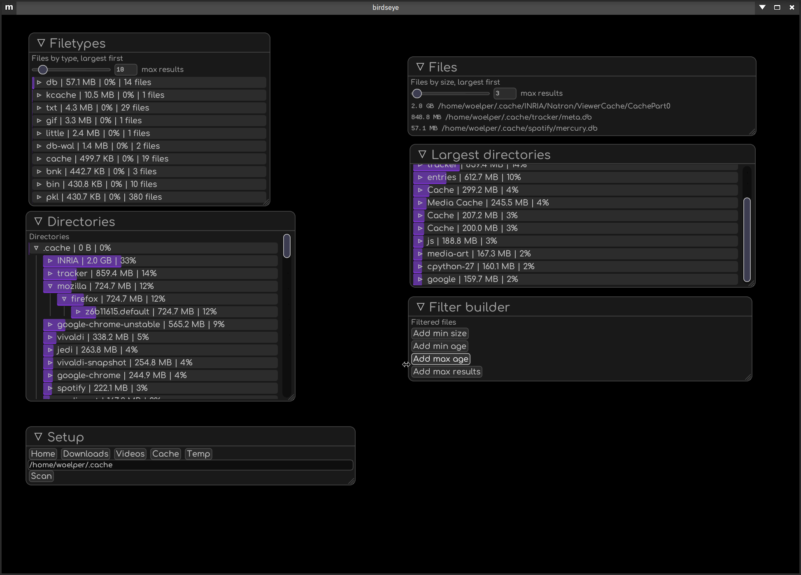

# birdseye

"What's taking up my disk space?"

Birdseye can help you find out and clean it up.

Features:
- Show largest individual files
- Show largest individual directories
- Browse directories, sorted by size
- Custom filter: Chain queries to find specific files (work in progress)
- Works on Mac, Windows and Linux (head to https://github.com/woelper/birdseye/releases) for builds)

